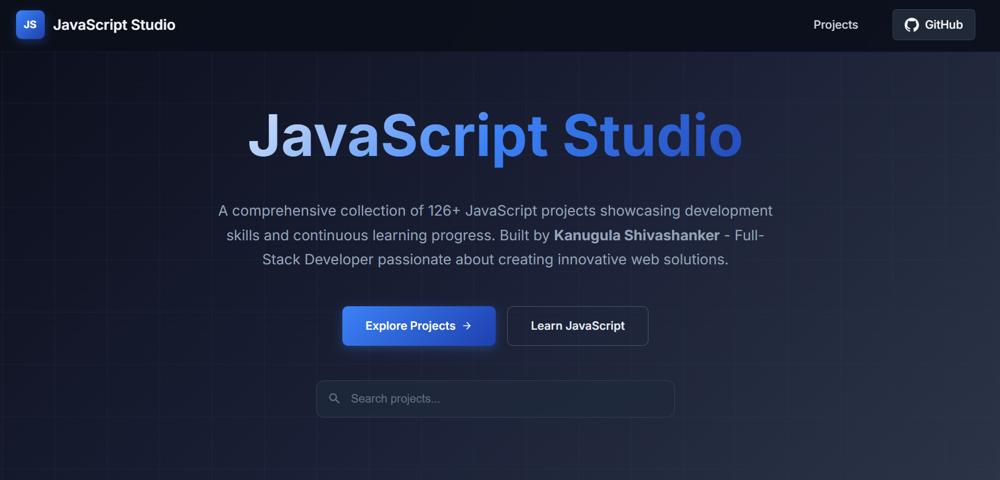
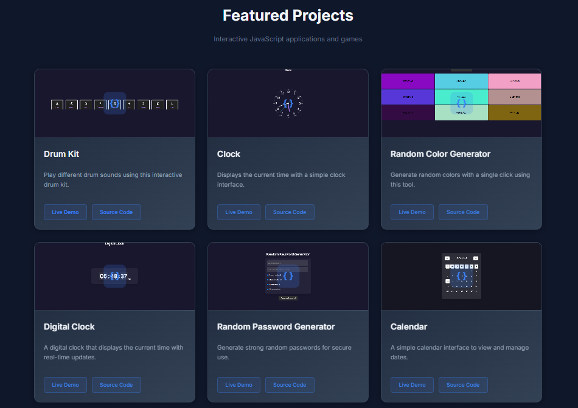

# JavaScript Projects Hub 

A comprehensive collection of **100+ JavaScript projects** for learning and mastering JavaScript through **practical, hands-on projects**.

---

## 🌐 Demo  
🔗 **Live Demo**: [JavaScript Projects Hub](https://javascript-studio1.netlify.app/)

### 📸 Demo Screenshots
<table>
  <tr>
    <td></td>
    <td></td>
  </tr>
</table>

---

## About Me

**Kanugula Shivashanker**  
Full-Stack Developer | React, Node.js, Express, MySQL  
Passionate about building dynamic web apps | Continuous learner | Open to collaboration.

---

## Project Overview

This repository contains **100+ JavaScript projects** ranging from beginner to advanced levels, demonstrating different aspects of JavaScript development:

- DOM Manipulation  
- Event Handling  
- API Integration  
- Game Development  
- Data Structures & Algorithms  
- UI/UX Implementation  

---

## Featured Projects

### Core Projects (Beginner)
| Project | Skills Demonstrated |
|---------|-------------------|
| Drum Kit | Event Listeners, Audio API |
| Clock | Date/Time Manipulation, CSS Animation |
| Random Color Generator | Math.random(), DOM Styling |
| Weather App | API Integration, Async/Await |
| Calculator | Complex Logic, Error Handling |
| To Do List | Local Storage, CRUD Operations |
| Tic Tac Toe | Game Logic, AI Implementation |

### Advanced Projects
- **Snake Game** - Canvas API, Game Physics  
- **Tetris Game** - Complex Game Logic, Matrix Operations  
- **Sorting Visualizer** - Algorithm Visualization  
- **Movie Search App** - External API Integration  
- **Currency Converter** - Real-time Data Fetching  

---

## Technologies Used

- **Frontend**: HTML5, CSS3, JavaScript (ES6+)  
- **APIs**: Various third-party APIs  
- **Tools**: Canvas API, Local Storage, Fetch API  
- **Concepts**: Responsive Design, Async Programming, OOP  

---

## Getting Started

### Prerequisites
- Modern Web Browser (Chrome, Firefox, Edge, Safari)  
- Code editor (VS Code recommended)  
- Live Server extension (for real-time preview)  

### Installation & Running the Projects

Clone the repository and navigate to the project folder:

git clone https://github.com/shivas1432/JavaScript-Studio
cd javascript-Studio

---

## Learning Path

- **Beginner Projects (1-30)**: DOM manipulation, event handling  
- **Intermediate Projects (31-70)**: API integration, complex logic  
- **Advanced Projects (71-100+)**: Game development, algorithm visualization  

---

## Connect With Me

- **LinkedIn**: [linkedin.com/in/shivashanker-kanugula-51a512252](https://www.linkedin.com/in/shivashanker-kanugula-51a512252)  
- **Portfolio**: [shivashanker.com](https://www.shivashanker.com)  
- **Instagram**: [@ss_web_innovations](https://instagram.com/ss_web_innovations)  
- **Telegram**: [@helpme_coder](https://t.me/helpme_coder)  

---

## Future Enhancements

- React.js implementations of existing projects  
- Node.js backend integration  
- Mobile-responsive improvements  
- Performance optimizations  
- Unit testing  

---

## Contributing

Suggestions and feedback are welcome!  

1. Fork the repository  
2. Create a feature branch  
3. Submit a pull request  

---

## License

MIT License – Free to use these projects for learning purposes.

---

**Made with ❤️ by Kanugula Shivashanker**  
*Full-Stack Developer passionate about creating innovative web solutions*
